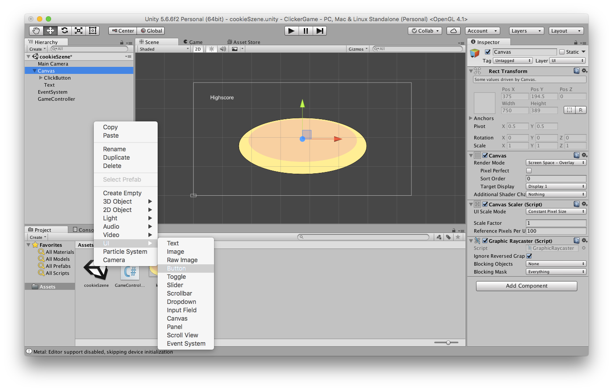
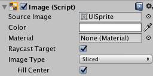
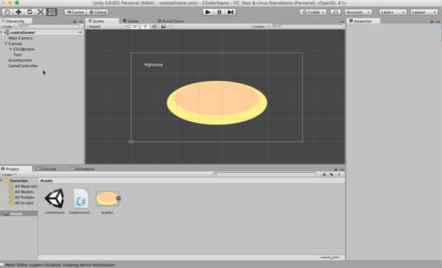
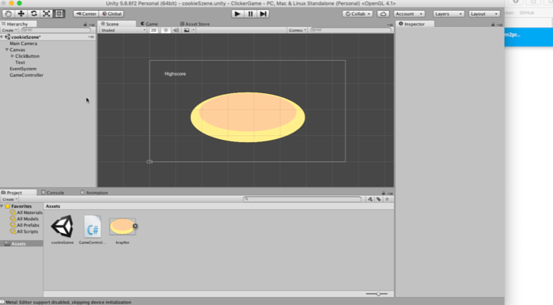

#Krapfenklicker - Das Spiel

!!!abstract "Lernziele"
    In diesem Kapitel erstellst du dein erstes Spiel - Krapfenklicker. Du lernst, wie du Variablen, Operatoren und Funktionen für das Programmieren der Spiellogik einsetzen kannst.


Das Spielprinzip von Krapfenklicker ist: SpielerInnen drücken so schnell sie können auf einen Knopf (Button) und erhalten dafür Punkte. 

---- 

##Szenenaufbau

Unity bietet Spielobjekte (GameObjects) für BenutzerInnen-Schnittstellen (User Interfaces), etwa Text, Benutzereingabe oder Buttons. Um ein User Interface Spielobjekt einzufügen, machst du einen Rechtsklick auf das Hierarchie Panel. Im Kontextmenü wählst du *UI*. Dort findest du die User Interface GameObjects.

Für Krapfenklicker brauchen wir einen *"Button"*. Wähle also *"UI">"Button"* aus dem Kontextmenü. Nenne den Button "ClickButton".



Platziere den Button in der Mitte der Szene. 


Weiters brauchst du noch einen Text für die Punkteanzeige. Wähle hierfür im Hierarchie Panel Kontextmenü *"UI">"Text"*. Platziere den Text am linken oberen Rand der Szene.

Du kannst das Button Bild austauschen, indem du in der *"Image"*-Komponente des ClickButtons das *"Source Image"* änderst. 



Lade etwa das Bild [krapfen.png](img/krapfen.png) auf deinen Computer und speichere es im *"Sprites"*-Ordner (Diesen Ordner kannst du im *"Assets"*-Ordner anlegen). Ziehe anschließend das *"krapfen"*-Sprite per Drag and Drop auf das *"Source Image"* deines Buttons. Verändere die Größe des Buttons, sodass dieser etwa zwei Drittel der Szene groß ist.


----

##Spiellogik

Für die Spiellogik kannst du in Krapfenklicker ein leeres GameObject einfügen. Dafür machst du wieder einen Rechtsklick auf das Hierarchie Panel und wählst *"Create Empty"*. Nenne das GameObject *"GameController"*. Füge dem GameController GameObject ein Skript hinzu. Nenne das Skript ebenfalls *"GameController"*. 

Überschreibe den Quellcode in der Datei "GameController.cs" mit:

``` c#
using System.Collections;
using System.Collections.Generic;
using UnityEngine;
using UnityEngine.UI;

public class GameController : MonoBehaviour {

	public Text meinHighscore; //DIES IST DIE VARIABLE, DURCH DIE DAS TEXTFELD VERWENDET WERDEN KANN
	public Button clickButton; //DIES IST DIE VARIABLE, DURCH DIE DER BUTTON IM SKRIPT VERWENDET WERDEN KANN

	//HIER DIE VARIABLE FÜR DEN PUNKTESTAND
	private int //ERGÄNZE HIER

	//DIESE FUNKTION WIRD AUSGEFÜHRT, WENN DER BUTTON GEKLICKT WIRD. 
	public void buttonclick()
	{
		highscore = //ERGÄNZE HIER
		meinHighscore.text = "Highscore: " + //ERGÄNZE HIER: ACHTUNG DATENTYP-UMWANDLUNG NOTWENDIG
		
	}
}

```

!!!success "Arbeitsauftrag"
    Ergänze die fehlenden Code-Teile, bevor du unten weitermachst.
    
##GameObjects in Unity den Variablen vom Skript zuweisen

Die Punkte sollen in der Punkteanzeige angezeigt werden. Klicke im Hierarchy Panel auf das GameObject "GameController", im Inspector siehst du nun das schon beigefügte Skript. Damit du im "GameController"-Skript auf dein Textfeld zugreifen kannst, musst du das Textfeld per Drag and Drop an die *"meinHighscore"*-Variable anheften. Damit das Skript mit dem richtigen Button verknüpft ist, ziehe auch den ClickButton in das entsprechende Feld!


    

!!!bug "ACHTUNG"
    Damit die ```buttonclick()``` Funktion ausgeführt wird, muss diese dem GameObject *"ClickButton"* zugewiesen werden.

Wie kannst du ```buttonclick()``` deinem Button zuweisen?
Wähle im Hierarchie Panel den Button (namens *"ClickButton"*) aus. Im Inspektor findest du eine GameObject Komponente *"Button (Script)"*. Dort ist eine Liste, in der du Funktionen angeben kannst, die ausgeführt werden sollen, wenn der Button gedrückt wird. 


Das funktioniert so: Drücke auf *"+"*. Wähle im ersten Menü *"Runtime Only"*. Ziehe das GameObject "GameController" aus dem Hierarchie Panel unter *"Runtime Only"*. Wähle zuletzt die Funktion *"buttonclick"* aus dem *"GameController"-Menü* im Menü neben *"Runtime Only"*.



----


Fertig!!!! Und jetzt Punkte sammeln :)
