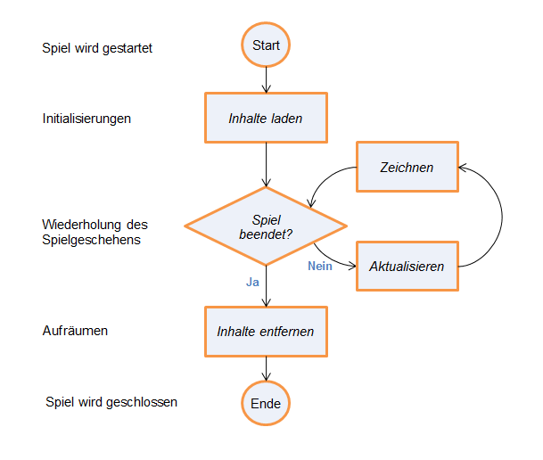

#Die Spielschleife

##Was ist eine Spielschleife?

In einer Spielschleife werden neben Kollisionsabfragen und der Bewegungsteuerung sogar noch viel grundlegendere Dinge, wie etwa das Zeichnen des Spieleinhalts erledigt. Eine Spielschleife ist eine Schleife, die fortlaufend wieder wiederholt wird und eine Handvoll wichtiger Grundfunktionen für ein Spiel beinhaltet. Eine typische Spielschleife sieht vom Konzept her etwa folgendermaßen aus:

##Weshalb benötigt man eine Spielschleife?
Die Spielschleife sorgt dafür, dass Ereignisse, die zum Spiel gehören, fortlaufend stattfinden.
Frage: "Kann man die Spielschleife nicht einfach selbst mit einer While-Schleife implementieren?"
Antwort: "Möglich ist das schon, aber die Spielschleife von Spieleentwicklungswerkzeugen beinhaltet auch Geschwindigkeitsoptimierungen, d.h. sie trägt die Verantwortung dafür, dass Spiele in der uns bekannten Geschwindigkeit auf gängiger Hardware ablaufen können. Mit einer selbstgemachten, nicht-optimierten Spielschleife, kann es leicht passieren, dass Spieler und Spielerinnen in einem halbwegs komplexen Spiel gerade mal alle 30 Sekunden einen Schritt machen können - Nicht gerade der größte Spielspaß!"

Ein weiteres Problem ist, dass das Spiel auf unterschiedlicher Hardware unterschiedlich schnell läuft. Um eine professionelle Implementierung einer Spielschleife kommt man in der Spieleentwicklung nicht herum.

##Einklinken in die Spielschleife in Unity

Folgende Funktionen eines Spielobjekt-Skripts werden in der Unity-Spielschleife ausgeführt:

1. **FixedUpdate()**
2. **Update()**
3. **LateUpdate()**

### FixedUpdate()

**FixedUpdate()** wird  in einem fixen Zeitintervall (Standardmäßig 50 Mal pro Sekunde) aufgerufen . **FixedUpdate()** sollte man immer dann verwenden, wenn man mit Objekten der Physics-Engine interagiert. Also z.B. wenn man die Geschwindigkeit eines RigidBodys verändert.

### Update()

**Update()** wird einmal pro Frame aufgerufen. Das heißt diese Funktion wird öfter aufgerufen, wenn die Framerate höher ist. Typische Aufgaben, die man in **Update()** durchführt sind z.B.

  * das Abfragen des Userinputs
  * Bewegung von Nicht-Physikobjekten
  * Timer

!!! Tip "Tipp"
    Wenn man in *Update()* Bewegungen implementiert, sollte man diese immer mit `Time.deltaTime` multiplizieren. Sonst bewegt sich das Objekt bei einer höheren Framerate schneller als bei einer niedrigen. (Time.deltaTime gibt die vergangene Zeit seit dem letzten Frame an)  
    **Fun Fact:** In dem Spiel *Fallout 76* ist genau dies schlecht implementiert und die Bewegungsgeschwindigkeit an die Framerate gebunden. Um zu verhindern, dass sich Spieler_innen mit einem besonders schnellen PC zu schnell bewegen, wurde das Problem in einem Patch durch Festlegen einer maximalen Framerate von 63 FPS "gefixt". [Link](https://www.altchar.com/games-news/582054/fallout-76-patch-fixes-speed-hacking-and-unlocks-fps)

### LateUpdate()

Ist genau wie **Update()** mit dem Unterschied, dass es in der Gameloop später aufgerufen wird. Diese Funktion wird eher selten verwendet, kann jedoch praktisch sein, wenn man etwas unbedingt nach dem Aufrufen von **Update()** ausgeführt werden soll. Ein typischer Anwendungsfall ist die Bewegung einer Kamera, die einem Objekt folgen soll, dessen Position sich in **Update()** verändert.

----

##Weiterführende Resourcen

Eine genaue Beschreibung der Funktionen findest du in der [offiziellen Unity Programmier-Referenz](https://docs.unity3d.com/ScriptReference/).

[Video zum Unterschied zwischen Update() und FixedUpdate()](https://unity3d.com/de/learn/tutorials/topics/scripting/update-and-fixedupdate)

[Genaue Execution-Order der Unity Gameloop](https://docs.unity3d.com/Manual/ExecutionOrder.html)
